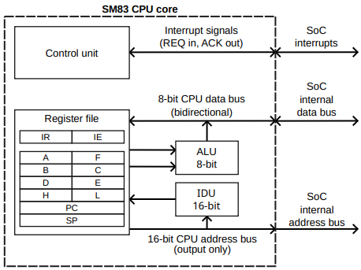
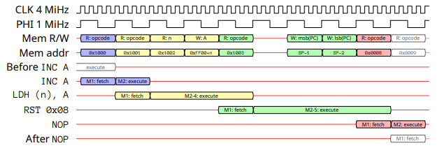

# Notes

## Register Definitions

| bit 7     | bit 6     | bit 5 | bit 4     | bit 3      | bit 2      | bit 1 | bit 0 |
| --------- | --------- | ----- | --------- | ---------- | ---------- | ----- | ----- |
| R/W-0     | R/W-1     | U-1   | R-0       | R-1        | R-x        | W-1   | U-0   |
| VALUE <1> | VALUE <0> | N/A   | BIGVAL<7> | BIGVAL <6> | BIGVAL <5> | FLAG  | N/A   |

Legend:

| Symbol    | Meaning                                                        |
| --------- | -------------------------------------------------------------- |
| R         | Bit can be read                                                |
| W         | Bit can be written.                                            |
| U         | Unimplemented bit.                                             |
| -n        | Value after system reset                                       |
| 1         | Bit is set                                                     |
| 0         | Bit is cleared                                                 |
| x         | Bit is unknown (depends on external things such as user input) |
| VALUE<n>  | Bit n of VALUE                                                 |
| N/A       | Unimplemented bit                                              |
| BIGVAL<n> | Bit n of BIGVAL                                                |
| FLAG      | Single-bit value FLAG                                          |

Reading a bit that is unimplemented or cannot be read returns a constant value
defined in the bit list of the register in question.

## Introduction

The original Game Boy (code name Dot Matrix Game) architecture had a Sharp SM83
CPU core and 4-level grayscale graphics.

## Clocks

### System Clock

The system oscillator is the primary clock source in a Game Boy system, and it
generates the system clock. Almost all other clocks are derived from the system
clock, but there are some exceptions:

- If a GB is set up to do a serial transfer in secondary mode, the serial data
  register is directly clocked using the serial clock signal coming from the
  link port. Two GBs connected with a link cable never have precisely the same
  clock phase and frequency relative to each other, so the clock of the primary
  side has no direct relation to the system clock of the secondary side.
- The inserted game cartridge may use other clock(s) internally.

The GB SoC uses two pins for the system oscillator: XI and XO. These pins along
with some external components can be used to form a Pierce oscillator circuit.

#### System Clock Frequency

In DMG and MGB console the system oscillator circuit uses an external quartz
crystal with a nominal frequency of 4.194304 MHz to form a Pierce oscillator
circuit. This frequency is considered to be the standard frequency of a GB.

### Clock Periods, T-cycles, and M-cycles

In digital logic, a clock switches between low and high states and every
transition happens on a clock dege, which might be a rising edge (low -> high
transition) or a falling edge (high -> low transition). A single clock period is
measured between two edges of the same type, so that the clock goes through two
opposing edges and returns to its original state after the clock period.

In addition to the system clock and other clocks derived from it, GB systems
also use inverted clocks in some peripherals, which means the rising edge of an
inverted clock may happen at the same time as a falling edge of the original
clock.

## Sharp SM83 CPU Core - Introduction

The CPU core in the GB SoC is a custom Sharp design that hasn't been publicy
been given a name by either Sharp or Nintendo. However, using old Sharp
datasheets and databooks as evidence, the core has been identified as a Sharp
SM83 CPU core, or at least something that is 100% compatible with it.

SM83 is an 8-bit CPU core with a 16-bit address bus. The Instruction Set
Architecture (ISA) is based on both Z80 and 8080.

## Simple Model

The core interacts with the rest of the SoC using interrupt signals, an 8-bit
bidirectional data bus, and a 16-bit address bus controlled by the CPU core.

The main subsystems of the CPU core are as follows:

### Control Unit

The control unit decodes the executed instructions and generates control signals
for the rest of the CPU core. It is also responsible for checking and
dispatching interrupts.

### Register File

The register file holds most of the state of the CPU inside registers. It
contains:

- The 16-bit Program Counter (PC)
- The 16-bit Stack Pointer (SP)
- The 8-bit Accumulator
- The Flags register
- General-purpose register pairs consisting of two 8-bit halves such as BC, DE,
  HL
- The special purpose 8-bit registers: the Instruction Register (IR) and
  Interrupt Enable (IE)

### ALU

An 8-bit Arithmetic Logic Unit (ALU) has two 8-bit input ports and is capable of
performing various calculations. The ALU outputs its result either to the
register file or the CPU data bus.

### IDU

A dedicated 16-bit Increment/Decrement Unit (IDU) is capable of performing only
simple increment/decrement operations on the 16-bit address bus value, but they
can be performed independently of the ALU. The IDU always outputs its result
back to the register file, where it can be written to a register pair or a
16-bit register.

## CPU Core Timing

Sharp SM83 uses a microprocessor design technique known as fetch/execute overlap
to improve CPU performance by doing opcode fetches in parallel with instruction
execution whenever possible. Since the CPU can only perform one memory access
per M-cycle, it is worth it to try to do memory operations as soon as possible.
Also, when doing a memory read, the CPU cannot use the data during the same
M-cycle so the true minimum effective duration of instructions is 2 machine
cycles, not 1 machine cycle.

Every instruction needs one machine cycle for the fetch state, and at least one
machine cycle for the decode/execute state. However, the fetch stage of an
instruction always overlaps with the last machine cycle of the execute stage of
the previous instruction. The overlapping execute stage cycle may still do some
work but memory access is reserved for the fetch stage of the next instruction.

Example of the CPU executing a program that starts from the address 0x1000 and
contains the following instructions:

| Address | Instruction |
| ------- | ----------- |
| 0x1000  | INC A       |
| 0x1001  | LDH (n), A  |
| 0x1003  | RST 0x08    |
| 0x0008  | NOP         |

The following timing diagram shows all memory operations done by the CPU, and
the fetch and execute stages of each instruction:

## Game Boy SoC peripheral and features

### Boot ROM

The Game Boy SoC includes a small embedded boot ROM, which can be mapped to the
0x0000 - 0x00FF memory area. While mapped, all reads from this area are handled
by the boot ROM instead of the external cartridge, and all writes to this area
are ignored and connot be seen by external hardware.

The boot ROM is enabled by default, so when the system exits the reset state and
the CPU starts execution from address 0x0000, it executes the boot ROM instead
of instructions from the cartridge ROM. The boot ROM is responsbile for showing
the initial logo, and checking that a valid cartridge is inserted into the
system. If the cartridge is valid, the boot ROM unmaps itself before execution
of the cartridge ROM starts at 0x0100.

The cartridge ROM has no chance of executing any instructions before the boot
ROM is unmapped, which prevents the boot ROM from being read byte by byte in
normal conditions.

Boot ROM Lock Register:

| bit 7 | bit 6 | bit 5 | bit 4 | bit 3 | bit 2 | bit 1 | bit 0    |
| ----- | ----- | ----- | ----- | ----- | ----- | ----- | -------- |
| U     | U     | U     | U     | U     | U     | U     | R/W-0    |
| N/A   | N/A   | N/A   | N/A   | N/A   | N/A   | N/A   | BOOT_OFF |

0b1 in bit 0 indicates that Boot ROM is disabled and 0x0000 - 0x00FF work
normally. 0b0 in bit 0 indicates that Boot ROM is active and intercepts accesses
to 0x0000 - 0x00FF.

The 1-bit BOOT register controls mapping of the boot ROM. Once 0b1 has been
written to unmap the boot ROM, it can only be mapped again by resetting the
system.

## DMA (Direct Memory Access)

## Sources

[Game Boy: Complete Technical Reference](https://gekkio.fi/files/gb-docs/gbctr.pdf)
